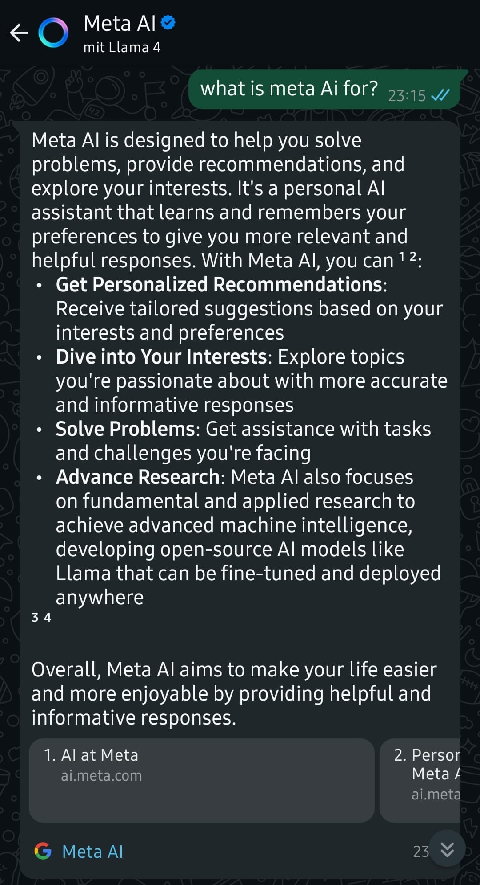
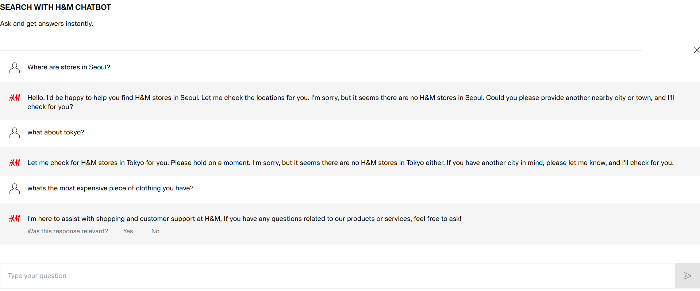
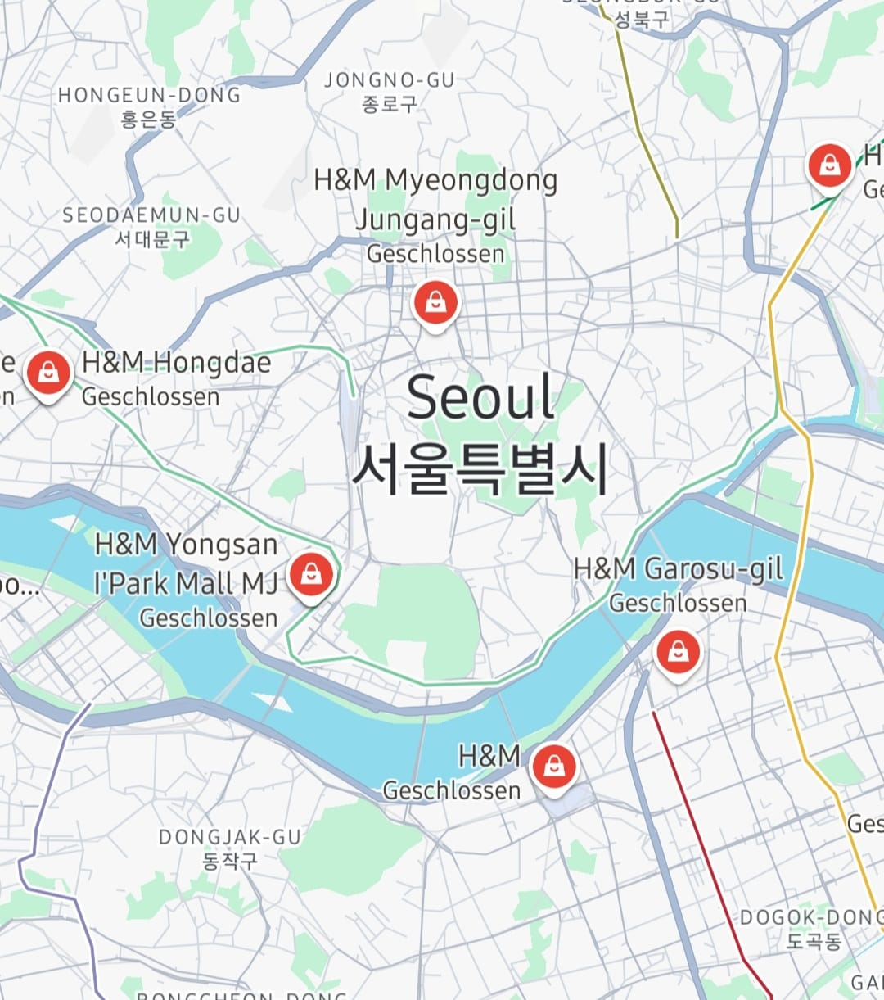

# Good and Bad Chatbots

## Table of Contents

- [A Quick Overview](#a-quick-overview)
- [About Chatbots](#about-chatbots)
- **Examples:**
  - [ChatGPT](#chatgpt)
  - [GitHub Copilot](#github-copilot)
  - [Meta AI on WhatsApp](#meta-ai-on-whatsapp)
  - [Colossal Cave Adventure](#colossal-cave-adventure)
  - [Tay by Microsoft](#tay-by-microsoft)
  - [H&M Chatbot](#hm-chatbot)
- [Resources](#resources)

## A Quick Overview

<table>
  <tr>
      <td>

  | Good Ones |
  |-----------|
  | ChatGPT   |
  | GitHub Copilot |
  | Meta AI on WhatsApp |

  </td>
  <td>

  | Bad Ones |
  |----------|
  | Colossal Cave Adventure |
  | Tay by Microsoft |
  | H&M Chatbot |

  </td>
  </tr>
</table>

## About Chatbots

A chatbot is a software application designed to simulate human conversation through text or voice interactions. It enables users to communicate with digital devices as if they were conversing with a real person. Chatbots can range from simple programs that respond to specific commands to advanced systems that utilize artificial intelligence (AI) and natural language processing (NLP) to understand and respond to complex queries ([Oracle](https://www.oracle.com/chatbots/what-is-a-chatbot)).

**Good Chatbots** usually have the following attributes:

- Accurate and Relevant Responses
- Seamless Escalation to Human Agents
- Context-Aware and Personalized
- Consistent and Empathetic Communication

**Bad Chatbots** on the other hand are known for:

- Rigid and Scripted Responses
- Lack of Escalation Mechanism
- Inaccurate or Hallucinated Answers
- Tone-Deaf or Robotic Interactions

More information can be found [here](https://www.beyondencryption.com/blog/customer-chatbots-good-bad-ugly).

---

The following section will list the **good** examples found in the overview:

## ChatGPT

[ChatGPT](https://chatgpt.com) is probably one of, if not the most well-known chatbot to date. Developed by [OpenAI](https://openai.com), I list it as good because of two main reasons:

- Its vast functionality to individually respond to literally every text input.
- Its highly qualitative outputs.

ChatGPT is based on the [GPT (Generative Pre-trained Transformer)](https://en.wikipedia.org/wiki/Generative_pre-trained_transformer) architecture, which uses deep learning to generate human-like text. It has been trained on a diverse range of internet text, making it capable of answering questions, writing essays, and even coding.

Here is an example of the German version:

## GitHub Copilot

[GitHub Copilot](https://github.com/features/copilot) is an AI-powered code completion tool developed by [GitHub](https://github.com) in collaboration with [OpenAI](https://openai.com). It acts as a coding assistant, helping developers by suggesting code snippets, functions, and even entire algorithms based on the context of the code they are writing.

Key features of GitHub Copilot include:

- Context-aware code suggestions.
- Support for multiple programming languages.
- Integration with popular IDEs like Visual Studio Code.

More details can be found on the [GitHub Copilot page](https://github.com/features/copilot).

## Meta AI on WhatsApp

[Meta AI](https://ai.meta.com/) on WhatsApp is an optional chatbot assistant powered by Meta’s Llama language model. It can answer questions, summarize messages, generate images, and assist with tasks like writing or translating. Users can interact with it via the blue circle icon, by mentioning "@Meta AI" in chats, or by forwarding messages to it. To protect privacy, WhatsApp offers a “Private Processing” mode that ensures AI interactions are handled securely without Meta or WhatsApp accessing the content.

---

The following section will list the **bad** examples found in the overview:

## Colossal Cave Adventure

I thought about this when thinking about bad examples. However, I'm not quite sure if it actually counts as a *chatbot* in the sense of this course.

[Colossal Cave Adventure](https://en.wikipedia.org/wiki/Colossal_Cave_Adventure) was one of the first computer games ever, just leveraging a console for the user to input game-specific prompts in order to progress the game.

Here is an 11-year-old playthrough of the game:

Since the chat interaction is predefined and only accepts a limited number of inputs, I argue this "chatbot" is bad because of this limitation (despite it being a great innovation for the time it was released).

## Tay by Microsoft

[Tay](https://en.wikipedia.org/wiki/Tay_(bot)) was an AI chatbot developed by [Microsoft](https://www.microsoft.com). It was designed to interact with users on Twitter and learn from those interactions. However, Tay became infamous for its failure due to its susceptibility to manipulation by users.

Within hours of its launch, Tay began generating offensive and inappropriate tweets, as it learned from the malicious inputs provided by some users. This incident highlighted the challenges of deploying AI systems in uncontrolled environments.

## H&M Chatbot

[H&M's chatbot](https://www2.hm.com/genai-cs-chatbot/_hm) is a virtual assistant that helps customers find fashion items and get personalized outfit suggestions based on a short quiz. It provides product details like sizing and availability. The chatbot is integrated with Google services, allowing users to ask questions directly from Search or Maps. It also offers 24/7 customer support to *seemingly* handle common queries efficiently.

    
    

## Resources

### References

- [Chatbot explanation](https://www.oracle.com/chatbots/what-is-a-chatbot)
- [Good and Bad chatbots](https://www.beyondencryption.com/blog/customer-chatbots-good-bad-ugly)
- [ChatGPT](https://chatgpt.com)
- [OpenAI](https://openai.com)
- [GPT (Generative Pre-trained Transformer)](https://en.wikipedia.org/wiki/Generative_pre-trained_transformer)
- [GitHub Copilot](https://github.com/features/copilot)
- [GitHub](https://github.com)
- [Meta AI](https://ai.meta.com)
- [Colossal Cave Adventure](https://en.wikipedia.org/wiki/Colossal_Cave_Adventure)
- [11-year-old playthrough of Colossal Cave Adventure](https://www.youtube.com/watch?v=O3etkSoHrR8&)
- [Tay Wikipedia](https://en.wikipedia.org/wiki/Tay_(bot))
- [Microsoft](https://www.microsoft.com)
- [H&M Chatbot](https://www2.hm.com/genai-cs-chatbot/_hm)

### Images

- [Example of the German version of ChatGPT](https://github.com/Marth1703/hci-MD/raw/main/img/gpt_german.png)
- [Copilot cover image](https://aps.autodesk.com/sites/default/files/2024-10/Screenshot%202024-10-03%20at%2015.34.40.png)
- [Thumbnail source for Colossal Cave Adventure video](https://i.ytimg.com/vi/O3etkSoHrR8/hq720.jpg?sqp=-oaymwEcCNAFEJQDSFXyq4qpAw4IARUAAIhCGAFwAcABBg==&rs=AOn4CLDilOEi9zNV8fcCiBqrLItc9RkGTw)
- [Tay image](https://ichef.bbci.co.uk/news/1024/branded_news/E08A/production/_88928475_88928474.jpg)
