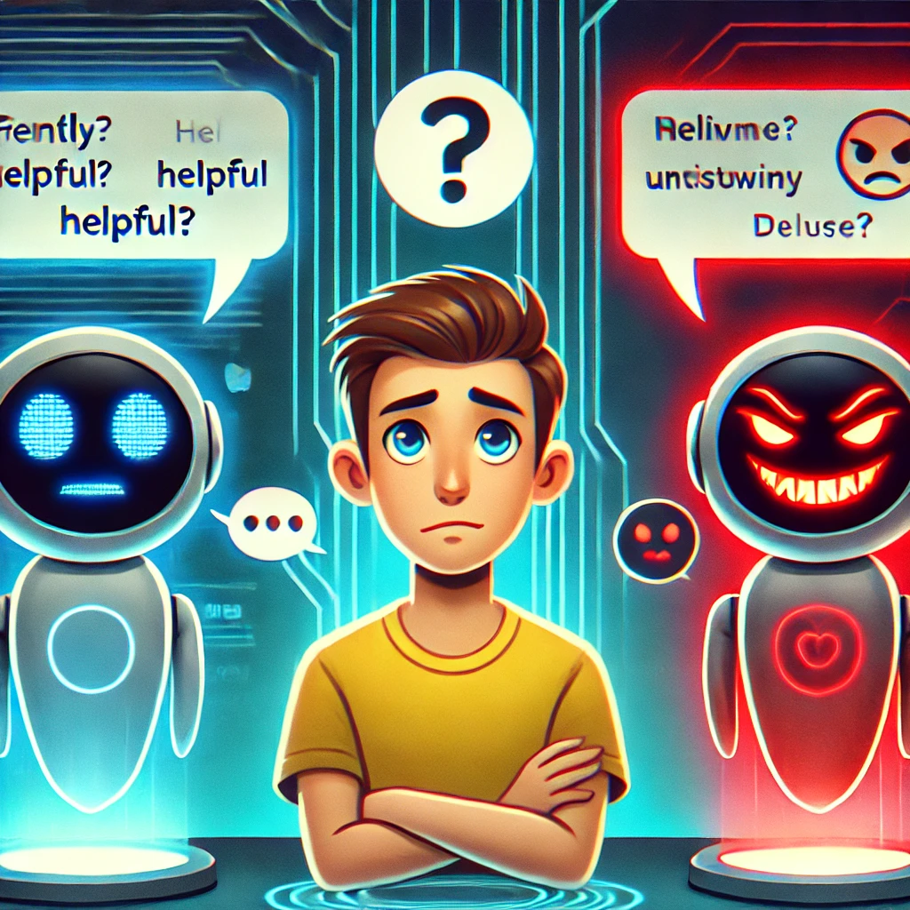
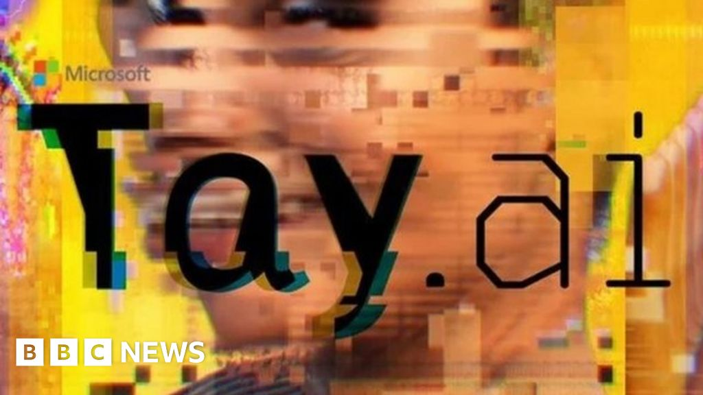

# Good and Bad Chatbots

## Table of Contents

- [A Quick Overview](#a-quick-overview)
- [ChatGPT](#chatgpt)
- [Github Copilot](#github-copilot)
- [Colossal Cave Adventure](#colossal-cave-adventure)
- [Tay by Microsoft](#tay-by-microsoft)
- [Resources](#resources)

## A Quick Overview

<table>
  <tr>
      <td>

  | Good Ones |
  |-----------|
  | ChatGPT   |
  | GitHub Copilot |

  </td>
  <td>

  | Bad Ones |
  |----------|
  | Tay by Microsoft |
  | Colossal Cave Adventure |

  </td>
  </tr>
</table>

In the following section, explanations of the examples will follow:

## ChatGPT

[ChatGPT](https://chatgpt.com) is probably one of, if not the most well-known chatbot to date. Developed by [OpenAI](https://openai.com), I list it as good because of two main reasons:

- Its vast functionality to individually respond to literally every text input.
- Its highly qualitative outputs.

ChatGPT is based on the [GPT (Generative Pre-trained Transformer)](https://en.wikipedia.org/wiki/Generative_pre-trained_transformer) architecture, which uses deep learning to generate human-like text. It has been trained on a diverse range of internet text, making it capable of answering questions, writing essays, and even coding.

Here is an example of the German version:

## GitHub Copilot

[GitHub Copilot](https://github.com/features/copilot) is an AI-powered code completion tool developed by [GitHub](https://github.com) in collaboration with [OpenAI](https://openai.com). It acts as a coding assistant, helping developers by suggesting code snippets, functions, and even entire algorithms based on the context of the code they are writing.

Key features of GitHub Copilot include:

- Context-aware code suggestions.
- Support for multiple programming languages.
- Integration with popular IDEs like Visual Studio Code.

More details can be found on the [GitHub Copilot page](https://github.com/features/copilot).

## Colossal Cave Adventure

I thought about this when thinking about bad examples. However, I'm not quite sure if it actually counts as a *chatbot* in the sense of this course.

Colossal Cave Adventure was one of the first computer games ever, just leveraging a console for the user to input game-specific prompts in order to progress the game.

Here is an 11-year-old playthrough of the game:

Since the chat interaction is predefined and only accepts a limited number of inputs, I argue this "chatbot" is bad because of this limitation (despite it being a great innovation for the time it was released).

## Tay by Microsoft

[Tay](https://en.wikipedia.org/wiki/Tay_(bot)) was an AI chatbot developed by [Microsoft](https://www.microsoft.com). It was designed to interact with users on Twitter and learn from those interactions. However, Tay became infamous for its failure due to its susceptibility to manipulation by users.

Within hours of its launch, Tay began generating offensive and inappropriate tweets, as it learned from the malicious inputs provided by some users. This incident highlighted the challenges of deploying AI systems in uncontrolled environments.

## Resources

- [ChatGPT](https://chatgpt.com)
- [OpenAI](https://openai.com)
- [GPT (Generative Pre-trained Transformer)](https://en.wikipedia.org/wiki/Generative_pre-trained_transformer)
- [Example of the German version of ChatGPT](https://github.com/Marth1703/hci-MD/raw/main/img/gpt_german.png)
- [GitHub Copilot](https://github.com/features/copilot)
- [GitHub](https://github.com)
- [Copilot cover image](https://aps.autodesk.com/sites/default/files/2024-10/Screenshot%202024-10-03%20at%2015.34.40.png)
- [11-year-old playthrough of Colossal Cave Adventure](https://www.youtube.com/watch?v=O3etkSoHrR8&)
- [Thumbnail source for Colossal Cave Adventure video](https://i.ytimg.com/vi/O3etkSoHrR8/hq720.jpg?sqp=-oaymwEcCNAFEJQDSFXyq4qpAw4IARUAAIhCGAFwAcABBg==&rs=AOn4CLDilOEi9zNV8fcCiBqrLItc9RkGTw)
- [Tay Wikipedia](https://en.wikipedia.org/wiki/Tay_(bot))
- [Microsoft](https://www.microsoft.com)
- [Tay image](https://ichef.bbci.co.uk/news/1024/branded_news/E08A/production/_88928475_88928474.jpg)
