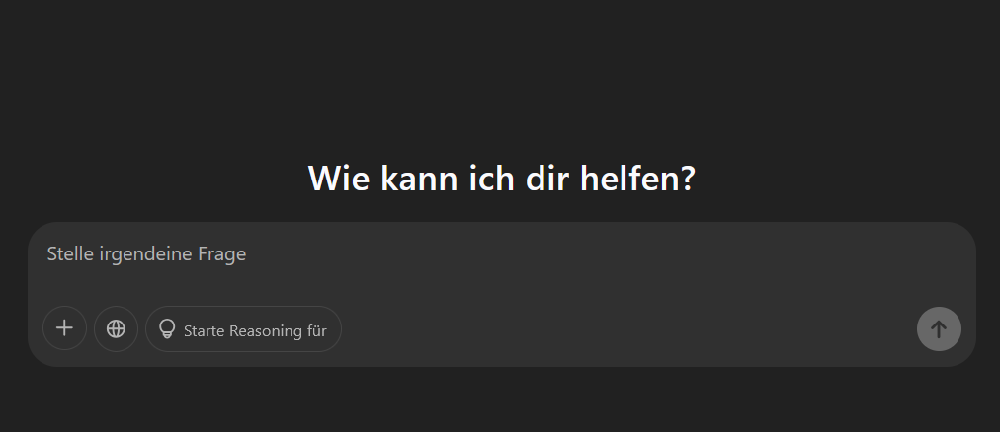

# Good and Bad Chatbots

This should serve as an overview of what I perceive as good and bad chatbots.

## A Quick Overview

I wanted to add two separate tables next to each other; apparently, that only works with inline HTML 😅.

<table>
  <tr>
      <td>

  | Good Ones |
  |-----------|
  | ChatGPT   |
  | GitHub Copilot |

  </td>
  <td>

  | Bad Ones |
  |----------|
  | Tay by Microsoft |
  | Colossal Cave Adventure |

  </td>
  </tr>
</table>

In the following section, explanations of **two** examples will follow:

## ChatGPT

[ChatGPT](https://chatgpt.com) is probably one of, if not the most well-known chatbot to date. I list it as good because of two main reasons:

- Its vast functionality to individually respond to literally every text input.
- Its highly qualitative outputs.

Here is an example of the German version:

## Colossal Cave Adventure

I thought about this when thinking about bad examples. However, I'm not quite sure if it actually counts as a *chatbot* in the sense of this course.

Colossal Cave Adventure was one of the first computer games ever, just leveraging a console for the user to input game-specific prompts in order to progress the game.

Here is an 11-year-old playthrough of the game:

